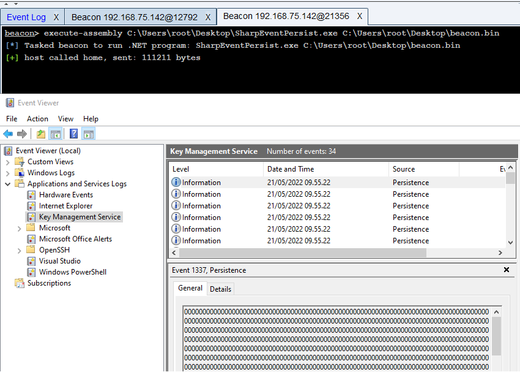

# SharpEventPersist
Persistence by writing/reading shellcode from Event Log.  
  
## Usage
The SharpEventPersist tool takes 4 case-sensitive parameters:  
* --file "C:\path\to\shellcode.bin"
* --instanceid 1337
* --source Persistence
* --eventlog "Key Management Service".  

The shellcode is converted to hex and written to the "Key Management Service", event level is set to "Information" and source is "Persistence".  
Run the SharpEventLoader tool to fetch shellcode from event log and execute it. Ideally this should be converted to a DLL and sideloaded on program start/boot.  
Remember to change the Event Log name and instanceId in the loader, if not running with default values.  
Remember to compile with ILMerge for NDesk.Options to work. I use this as Post-build event command line:  
```powershell
$(ProjectDir)packages\ILMerge.3.0.41\tools\net452\ILMerge.exe /target:winexe /targetplatform:"v4,C:\Program Files (x86)\Reference Assemblies\Microsoft\Framework\.NETFramework\v4.8" /out:$(ProjectDir)SharpEventPersist.exe $(ProjectDir)bin\Release\SharpEventPersist.exe $(ProjectDir)packages\NDesk.Options.0.2.1\lib\NDesk.Options.dll
```

